# ringzero

A small L4 load balancer built to show what eBPF and XDP can do. It runs inside the kernel's packet receive path, in ring 0, before the kernel even builds a socket buffer for the packet. That's why one box can forward tens of millions of packets per second on the right hardware.

The design is copied from [Katran](https://github.com/facebookincubator/katran), Facebook's production load balancer. This version is much smaller. You can read the whole thing in an afternoon. It's a demo and a learning project, not something you'd run in production.

## Architecture



There are two parts:

- **Data plane**: `bpf/xdp_lb.c`. A C program compiled to eBPF bytecode and attached to a network interface. This is the part that forwards packets. It never talks to the control plane while running.
- **Control plane**: `src/*.zig`. A Zig CLI called `ringzero`. It loads the eBPF program, manages backends, checks their health, and reports stats.

## How a packet gets forwarded

1. The NIC driver hands the raw frame to `xdp_lb_prog`. No socket buffer exists yet.
2. The program checks if the destination IP, port, and protocol match one of its virtual IPs (`vip_map`). If not, it passes the packet up to the normal kernel network stack, untouched.
3. It hashes the packet's 5-tuple and looks up a backend in a per-VIP Maglev table (`maglev_map`). This is [Maglev](https://research.google/pubs/pub44824/) consistent hashing, the same algorithm Katran uses. Every packet in a flow lands on the same backend. When a backend is added or removed, only a small fraction of flows move to a new backend, not almost all of them.
4. It rewrites the destination IP and MAC to the chosen backend and redirects the packet there. No port translation happens. This is direct server return, the same approach Katran uses.
5. It bumps a per-CPU packet counter.

Four steps, four map lookups, all O(1). That's the whole reason this can run at line rate: no memory allocation, no walk through the IP stack, no per-flow connection table, no lock contention.

## Why this is fast and a normal proxy isn't

A normal proxy (nginx, HAProxy, a userspace load balancer) sees a packet only after the kernel has fired an interrupt, allocated a socket buffer, walked the IP and TCP/UDP stack, matched a socket, and copied the data somewhere a `read()` call can see it. Each step costs CPU cycles and cache misses.

XDP skips all of that for packets it forwards or drops. The eBPF verifier proves the program is safe before it's allowed to load, so the kernel doesn't need runtime safety checks while it's running. And because RSS spreads incoming packets across multiple NIC queues, each CPU core processes its own share of traffic with no cross-core handoff.

## Repository layout

```
bpf/
  common.h      Struct and constant definitions shared by the BPF program
                and the Zig control plane.
  xdp_lb.c      The data plane.
  xdp_pass.c    A trivial XDP_PASS program, used only by the local demo
                (explained below).
src/
  main.zig      The ringzero CLI: attach, detach, vip-add, backend-add,
                backend-set, list, stats, healthcheck.
  maglev.zig    The consistent-hashing table builder.
  c.zig         The single point where Zig imports libbpf and common.h.
bench/
  floodgen.c    A multithreaded UDP packet generator for load testing.
scripts/
  setup-netns.sh / teardown-netns.sh
                A demo topology built from network namespaces, so you can
                run this without a second machine or a real NIC.
  verify_datapath.py
                Checks the data plane's packet rewriting in isolation. See
                "Checking correctness" below.
```

## Building

You need clang, llvm, bpftool, libbpf-dev, and Zig (built against a `0.16.0-dev` snapshot, check `build.zig.zon` for the exact version). On Ubuntu:

```
sudo apt install clang llvm libbpf-dev linux-tools-common linux-tools-generic
```

Then:

```
make bpf     # generates bpf/vmlinux.h from your kernel's BTF, builds xdp_lb.o and xdp_pass.o
make zig     # builds zig-out/bin/ringzero
make bench   # builds bench/floodgen
# or just: make
```

`bpf/vmlinux.h` is generated from whatever kernel you build on, using its BTF data. This project doesn't ship portable CO-RE relocations across kernel versions yet. It compiles fresh each time.

## Using the CLI

```
ringzero attach --iface IFACE [--obj bpf/xdp_lb.o] [--mode auto|native|generic] [--pindir DIR]
ringzero detach --iface IFACE [--purge] [--pindir DIR]
ringzero vip-add --vip IP --port PORT --proto tcp|udp [--pindir DIR]
ringzero backend-add --vip IP:PORT/proto --addr IP --mac MAC --router-mac MAC --iface IFACE [--pindir DIR]
ringzero backend-set --id ID (--up|--down) [--pindir DIR]
ringzero list [--pindir DIR]
ringzero stats [--watch] [--interval SEC] [--pindir DIR]
ringzero healthcheck [--interval SEC] [--timeout-ms MS] [--pindir DIR]
```

`--mac` and `--router-mac` are set by hand, not resolved through ARP. That matches how real DSR load balancers are usually set up: backends sit on a directly attached segment with known neighbors. `healthcheck` runs a TCP connect probe. UDP backends have no generic way to check reachability, so they're always treated as healthy unless you flip them with `backend-set --down`.

Once `attach` loads the program and pins its maps under `/sys/fs/bpf/ringzero`, the CLI process can exit. The data plane keeps running with no userspace process attached. Later commands like `vip-add` just open the pinned maps directly.

## Running the local demo

You don't need a physical NIC or a second machine. `scripts/setup-netns.sh` builds a topology out of network namespaces and veth pairs: a client, a router where the XDP program attaches, and a backend.

```
sudo ./scripts/setup-netns.sh
sudo ip netns exec client ./bench/floodgen 10.99.0.1 9000 5
sudo ./zig-out/bin/ringzero stats --watch
sudo ./scripts/teardown-netns.sh
```

Watch the packet count in `ringzero stats` climb while `floodgen` runs. That's the data plane matching the VIP, hashing the flow, rewriting the packet, and redirecting it, all inside the kernel.

## Checking correctness

Each backend namespace runs a small UDP counter (`scripts/udp_sink.py`, logged to `/tmp/ringzero-backend*.log`) so you can watch packets arrive. Whether it shows nonzero counts depends on your host's network stack and its settings. Cross-namespace UDP delivery over veth can be sensitive to things like conntrack and GRO state that have nothing to do with this project's code.

If you want to check the data plane on its own, without your local network stack in the way, use `bpftool prog run`:

```
sudo bpftool net show                     # find the attached program's id
sudo ./scripts/verify_datapath.py --prog-id <id> \
    --vip 10.99.0.1 --vip-port 9000 --proto udp --expect-dst 10.20.0.2
```

This builds a real Ethernet, IP, and UDP packet, runs it through the loaded program, and checks that the rewritten packet has a valid checksum and the right backend as its destination. `bpftool prog run` lets you test a BPF program the way you'd test any function, without needing a working network path around it.

## About the numbers

This demo runs on veth pairs inside one kernel, processed by whatever single CPU handles that interface's one RX queue. There's no RSS spreading work across cores the way a real NIC provides. Expect low single digit millions of packets per second on a dev box, not 10 million. That ceiling belongs to this test setup, not to XDP or this code.

To get near what the project's name promises, you need what Katran actually runs on: multi-queue NICs with native XDP driver support (Mellanox mlx5, Intel i40e or ice), RSS spreading flows across many cores, and native attachment (`ringzero attach --mode native`). On real hardware you also don't need the `xdp_pass.c` workaround. That program exists only because redirecting between two veth interfaces requires both ends to have XDP enabled, which a real NIC's egress path doesn't need.

## What's missing compared to Katran

- No IPIP or GUE encapsulation. Katran usually tunnels the original packet so backends can live anywhere on the network. This project rewrites headers directly and expects backends on a directly attached segment.
- No BGP or ECMP integration. Katran's control plane announces VIPs over BGP so upstream routers can spread traffic across many LB boxes. Here, one box does the whole job.
- IPv4 only.
- Health checking is a plain TCP connect probe, not a pluggable, application-aware check.
- No CO-RE portability across kernel versions.

## License

No license yet. All rights reserved by default until one is added.
